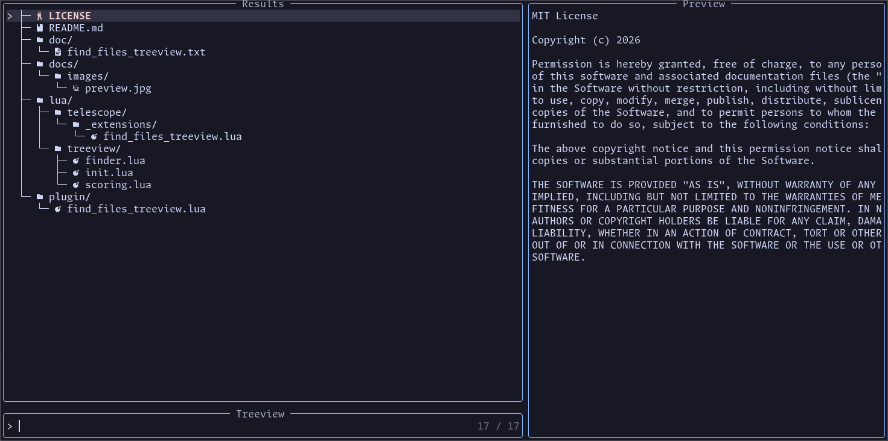

# find_files_treeview

Tree view file picker for Telescope. It keeps the familiar file previewer, while rendering results as a directory tree. When you type a query, directories are reordered by the best matching file in their subtree, and matching directories temporarily expand.



## Disclaimer

This is 100% vibecoded. Feel free to open an issue if you find a bug or have a feature request but I can't make any promises.

## Why

I'm currently moving away from VSCode and for me it is still easier to reason about my project with a treeview of my project structure.

## Requirements

- Neovim 0.9+
- `nvim-telescope/telescope.nvim`
- Optional: `nvim-tree/nvim-web-devicons` for icons

## Install (lazy.nvim)

```lua
{
  "nvim-telescope/telescope.nvim",
  dependencies = {
    { "nvim-lua/plenary.nvim" },
    { "nvim-tree/nvim-web-devicons", optional = true },
    { "Huuums/telescope-find_files_treeview" },
  },
  opts = function(_, opts)
    opts.extensions = opts.extensions or {}
    opts.extensions["find_files_treeview"] = {
      icons = true,
    }
  end,
  config = function(_, opts)
    require("telescope").setup(opts)
    require("telescope").load_extension("find_files_treeview")
  end,
}
```

Minimal install:

```lua
{
  "nvim-telescope/telescope.nvim",
  dependencies = {
    { "nvim-lua/plenary.nvim" },
    { "Huuums/telescope-find_files_treeview" },
  },
  config = function()
    require("telescope").load_extension("find_files_treeview")
  end,
}
```

## Usage

```vim
:Telescope find_files_treeview
```

Example normal-mode mapping:

```lua
vim.keymap.set("n", "<leader><C-p>", "<cmd>Telescope find_files_treeview treeview<cr>", { desc = "Treeview" })
```

## Options

All options can be passed to the picker or set in `telescope.setup` under `extensions["find_files_treeview"]`.

- `icons` (boolean, default: auto)
  - Show file and folder icons when `nvim-web-devicons` is available.
- `persist` (boolean, default: true)
  - Persist expanded/collapsed directories across sessions.
- `persist_path` (string)
  - Custom persistence file path. Default: `stdpath("state")/treeview.json`.
- `mappings` (table)
  - Override default keybindings.
- `find_command` (table)
  - Custom file list command. Defaults to Telescope `find_files` config, then `fd`, then `rg`.

## Default mappings

- `<Right>`: expand directory
- `<Left>`: collapse directory
- `<C-Right>`: expand all directories
- `<C-Left>`: collapse all directories
- `<C-Down>`: next matching file (Selection skips over directories)
- `<C-Up>`: previous matching file (Selection skips over directories)

## Custom mappings

```lua
local actions = require("telescope").extensions.find_files_treeview.actions

require("telescope").setup({
  extensions = {
    ["find_files_treeview"] = {
      mappings = {
        i = {
          ["<C-j>"] = actions.next_file,
          ["<C-k>"] = actions.prev_file,
          ["<Right>"] = actions.expand_dir,
          ["<Left>"] = actions.collapse_dir,
        },
        n = {
          ["l"] = actions.expand_dir,
          ["h"] = actions.collapse_dir,
        },
      },
    },
  },
})
```

## Actions API

```lua
local actions = require("telescope").extensions.find_files_treeview.actions

actions.toggle_dir(prompt_bufnr)
actions.expand_dir(prompt_bufnr)
actions.collapse_dir(prompt_bufnr)
actions.expand_all(prompt_bufnr)
actions.collapse_all(prompt_bufnr)
actions.next_file(prompt_bufnr)
actions.prev_file(prompt_bufnr)
```
